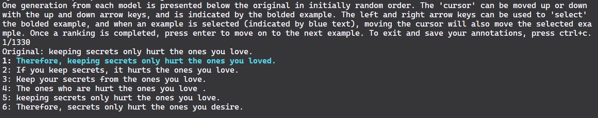

# blind_rank


A simple Python script for ergonomic and fast blind ranking of sets of generations in the terminal. Supports concurrent ranking by multiple annotators with automatic merging of results. This was originally written to evaluate generations from models for formality style transfer (see example data), but it can be used for any task where you want to rank a set of generations without knowing which model produced each generation.

Wonky things can happen if your terminal window is too small, so make sure it's big enough to display the full prompt and set of generations. Assuming you use the CSV input method, this code is robust to generations and inputs with newlines, but this could significantly increase the height of the terminal window required.

Directions for the interface are provided in the terminal when you run the script.

If you find the bold text for the cursor doesn't stand out enough, you can change it by setting `CURSOR_COLOR` in `blind_rank.py` to a different color. 

## Usage
There are two input modes:
1. A single directory containing all the generations to be ranked and the prompts/originals/model inputs where each model has a separate file, and within these files each generation is a separate line. Note that you should remove newlines from the generations and inputs for this method to work properly. The name of the file containing the model inputs is by default `originals.txt`, but can be changed with the `--prompt_filename` argument. This is the default input method just because it's slightly simpler to use.
2. A single directory containing a CSV for each model, where the CSV has a `generation` and `original` row, and the CSVs for each model are in the same order. This is at least in my experience the more natural input method. To use this input method, use the `-c` flag.

The only required argument is `--input_dir`, which specifies the directory containing the generations to be ranked and their originals. The other arguments are optional, but I encourage you to use `--help` to explore them.

The only package required is `pandas`, which can be installed with `pip install pandas`.

## Example
```
python3 blind_rank.py --input_dir example_data --output example_ranking.csv --annotator landrum --axis formality --shuffle --prompt_filename originals.txt
```